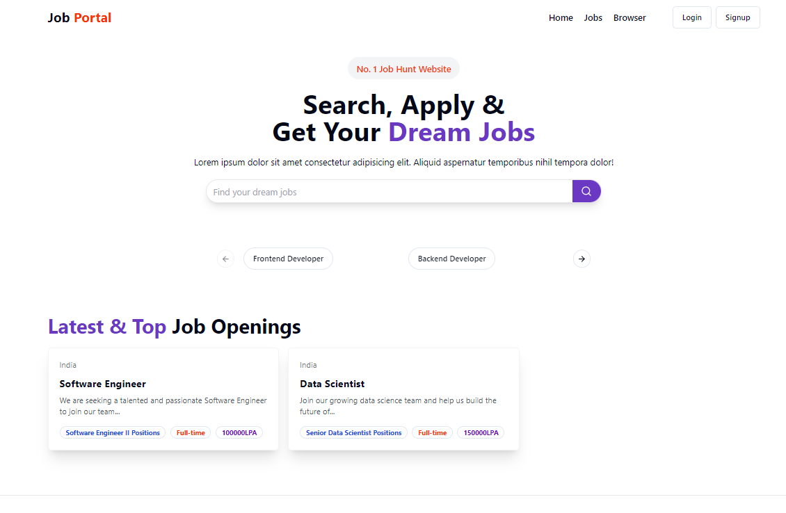

# Job Portal Frontend

This project is a modern job portal frontend application built with React and Vite. It provides a user-friendly interface for job seekers to browse and apply for job listings, and for employers to post job opportunities.

## Features

- User authentication
- Job listing and search functionality
- Detailed job descriptions
- Application submission process
- Responsive design for various devices

## Technologies Used

- React 18
- Vite
- Redux Toolkit for state management
- React Router for navigation
- Tailwind CSS for styling
- Radix UI for accessible component primitives
- Axios for API requests
- Framer Motion for animations
- Sonner for toast notifications

## Getting Started

1. Clone the repository
2. Install dependencies with `npm install`
3. Start the development server with `npm run dev`
4. Open `http://localhost:3000` in your browser

## Scripts

- `npm run dev`: Start the development server
- `npm run build`: Build the project for production
- `npm run lint`: Run ESLint for code linting
- `npm run preview`: Preview the production build locally

## Project Structure

The project follows a standard Vite + React structure, with components organized in the `src/components` directory. The `src/Redux` directory contains Redux slices for state management.

## Contributing

Contributions are welcome! Please feel free to submit a Pull Request.

## License

This project is open source and available under the [MIT License](LICENSE).
